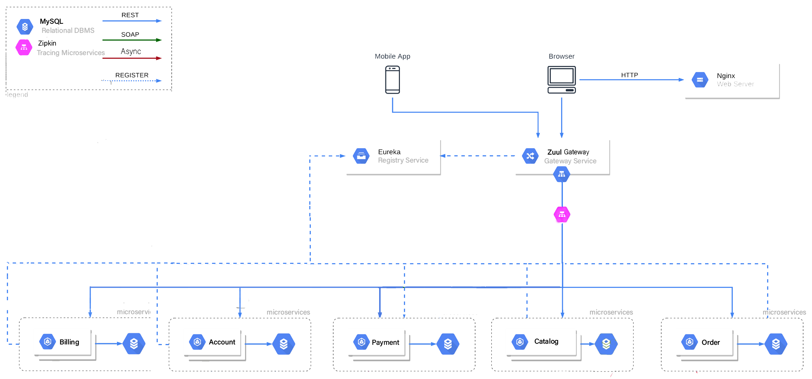
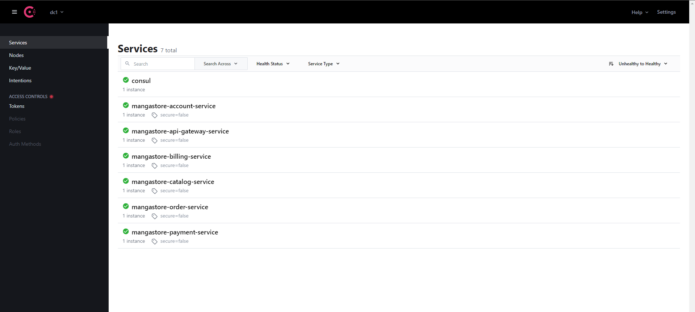
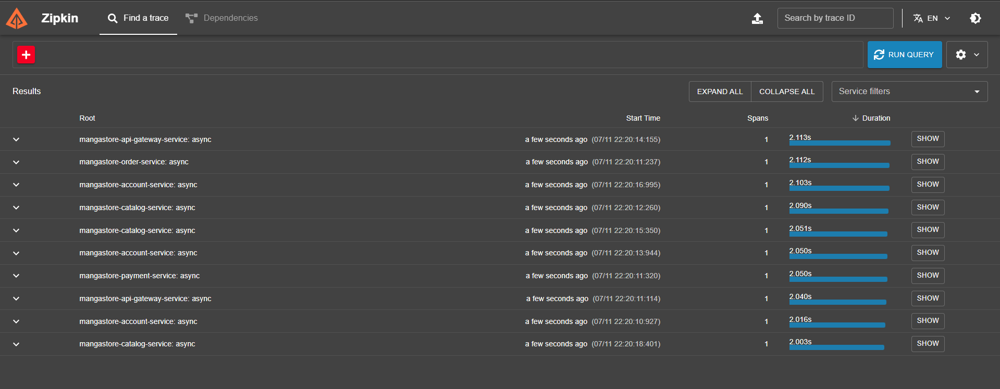

# MangaWorld Full Stack Application (SOSE)

## Architecture Overview

The MangaStore application employs a **microservices architecture** using Spring Boot.
In local environments, each microservice registers with an **Eureka discovery server** , while for **Docker-based deployments**, **Consul** is used for service registration. The frontend, developed with **React**, interacts via an **NGINX server**, which functions as a reverse proxy, forwarding requests to the **Zuul API Gateway**. Zuul subsequently routes these requests to the correct microservices based on the URL path, utilizing Eureka or Consul for **service discovery**.





### Project Preview Video 
[](https://youtu.be/f_aOUzYFDnY)


### Service Discovery

- **Local Development**: Eureka
- **Docker Deployments**: Consul

**Consul** is preferred in Docker due to its robust features and support. In local environments, we use **Eureka** to avoid the overhead of managing Consul agents.

## Running the Project Locally

### Frontend Application

Navigate to the `MangaStore-Frontend-React` directory and run the following commands to start the frontend React application:

```sh
yarn install

yarn add cross-env

yarn start
```

### Backend Services

To start the **backend services**, follow these steps:

**Using IntelliJ/Eclipse or Command Line**

*** 1. Import the project into your IDE. ***

*** 2. Run all Spring Boot projects or build all jars using the following command: *** 

```java
mvn clean install
```

This will build all the jars and start the services on the specified ports. This method does not include monitoring of microservices.

**Using Docker (Recommended)**

Start all containers using Docker Compose:

```sh
docker-compose up --build
```
## Microservices Roles and Communication

### Microservices Roles

1. **Account Service**
   - **Role**: Provider
   - **Description**: Manages user accounts and authentication.

2. **Billing Service**
   - **Role**: Provider
   - **Description**: Handles billing and invoicing operations.

3. **Eureka Discovery Service**
   - **Role**: Provider
   - **Description**: Service registry for discovering microservice instances in local environments.

4. **Consul Discovery Service**
   - **Role**: Provider
   - **Description**: Service registry for discovering microservice instances in Docker environments.
   
5. **Catalog Service**
   - **Role**: Provider
   - **Description**: Manages product catalog and inventory.

6. **Payment Service**
   - **Role**: Provider
   - **Description**: Manages payment transactions.

7. **Order Service**
   - **Role**: Prosumer
   - **Description**: Handles order processing, consumes data from the Catalog and Billing services.

8. **Zipkin Service**
   - **Role**: Prosumer
   - **Description**: Provides distributed tracing for monitoring microservices.

9. **Zuul API Gateway Service**
   - **Role**: Prosumer
   - **Description**: Acts as an entry point for all client requests, routes them to appropriate services, and consumes discovery services.


### Synchronous vs Asynchronous Communication

- **Synchronous Communication**
  - **Microservices Involved**: Zuul API Gateway Service, Account Service, Catalog Service, Billing Service, Order Service, Payment Service.
  - **Description**: These services communicate synchronously to ensure immediate data consistency and real-time processing. For example, the Order Service synchronously calls the Catalog Service to check product availability.

- **Asynchronous Communication**
  - **Microservices Involved**: Order Service (event-driven processing), Zipkin Service (tracing data).
  - **Description**: Asynchronous communication is used for operations that can be processed independently and don't require an immediate response. The Order Service may publish events for other services to process asynchronously, and Zipkin collects tracing data asynchronously to monitor service interactions.

### Services and Ports : 

   **API Gateway Service: 8765**
    **Eureka Discovery Service: 8761 (Local)**
    **Consul Discovery: 8500 (Docker)**
    **Account Service: 4001**
    **Billing Service: 5001**
    **Catalog Service: 6001**
    **Order Service: 7001**
    **Payment Service: 8001**
    **Zipkin Service: 9411**


### Consul Dashboard



### Docker Container Overview


### Zipkin Tracing


### Zipkin for Tracing

Zipkin is used for tracing requests across microservices, helping to monitor and troubleshoot latency issues.


### Database
We use MySQL as the database. Utilize the Postman API collection located in the Postman directory to make requests to various services.

**Users**

***Admin User:***

Username: 'admin.admin'
Password: 'admin.admin'

****Normal User:***

Username: 'user.normal'
Password: 'user.password'

###  Troubleshooting
If you encounter issues starting services or API failures, it may be due to new columns or tables. Clear or drop mangastore_db and try again. If the issue persists, raise an issue on GitHub for assistance.

###   Future Updates
Deployment
In future versions, the project will be deployed using Kubernetes across multiple regions and availability zones. The React App, Zuul, and Eureka will be public-facing services located in a public subnet, while private subnets will use NAT Gateway for external requests.